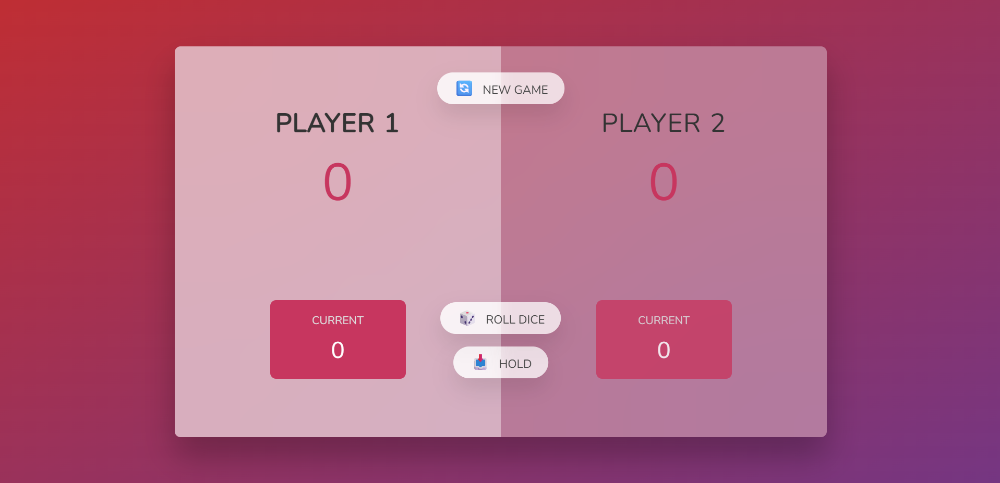

# 🎲 Dice Game

A simple and interactive two-player dice game built using **HTML, CSS, and JavaScript**. Players take turns rolling a dice, accumulating points, and strategically holding their score to reach the winning target.

---

## 📸 Preview




---

## 🚀 Live Demo

👉 https://sam1635.github.io/Dice-Game/

---

## ✨ Features

- 🎮 Two-player gameplay
- 🎲 Random dice rolling
- ➕ Current score tracking
- 💾 Hold score functionality
- 🔄 Switches player automatically when a 1 is rolled
- 🏆 Winning state with game reset
- 🎨 Modern glassmorphism-inspired UI
- 📱 Responsive design

---

## 🛠️ Built With

- HTML5
- CSS3
- JavaScript (ES6)

---

## 📂 Project Structure

```
Dice-Game/
│
├── index.html
├── style.css
├── script.js
├── dice-1.png
├── dice-2.png
├── dice-3.png
├── dice-4.png
├── dice-5.png
├── dice-6.png
└── README.md
```

---

## 🎯 Game Rules

1. The game starts with **Player 1**.
2. Click **Roll Dice** to roll the dice.
3. If the dice shows **2-6**, the number is added to the current score.
4. If the dice shows **1**:
   - Current score becomes **0**.
   - Turn switches to the other player.
5. Click **Hold** to add the current score to your total score.
6. The first player to reach the winning score wins the game.
7. Click **New Game** to restart.

---

## 💻 How to Run

1. Clone the repository

```bash
git clone https://github.com/Sam1635/Dice-Game.git
```

2. Open the project folder

```bash
cd Dice-Game
```

3. Open `index.html` in your browser.

---

## 📚 What I Learned

Through this project, I practiced:

- DOM Manipulation
- Event Listeners
- JavaScript Functions
- Conditional Statements
- Arrays & Variables
- Random Number Generation
- Dynamic UI Updates
- CSS Positioning & Flexbox
- Game Logic Implementation


---

## 📄 License

This project is open source and available under the **https://github.com/jonasschmedtmann**.

---

## 👨‍💻 Author

**Sam Jebaraj**

- GitHub: https://github.com/Sam1635
- LinkedIn: https://www.linkedin.com/in/samjebaraj-isaac/

---
